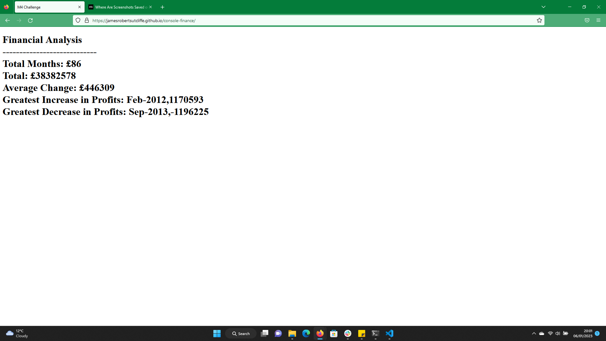

## Console Finace

## Description

    What was your motivation?
    Why did you build this project? (Note: the answer is not "Because it was a homework assignment.")
    What problem does it solve?
    What did you learn?
    What makes your project stand out?

I was motivated to complete this project so that I could gain a more in depth understanding of logic in javascript. I built it to develop my logic and syntax skills within javascript. The project solves a number of prompted mathematical problems using javascript fundamentals. By completing this project I gained a more in depth understanding of javascript fundamentals including Arrays, Loops and Variables.

## Installation

N/A.

## Usage

The results table has been pushed to the HTML page. The results have also been logged to the console.

## Credits

N/A.

## License

please see license file in main branch of gitHub repository.

## Deployed Site

https://jamesrobertsutcliffe.github.io/console-finance/
